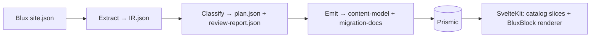

# Blux → Reddoor Catalog Pipeline — Design Spec

- **Date:** 2026-07-17
- **Status:** Approved design (v2, revised after a 4-lens adversarial review), pending implementation plan
- **Repos touched:** `reddoor-maintenance` (the `blux` CLI: extract/classify/emit), `reddoor-starter` (shared SvelteKit + Prismic template: catalog slices, custom types, renderer), and per-site repos (re-conversion targets)
- **Supersedes:** the band/manifest hybrid (`convert` band-plan + `blux-presentation.json` side-car) and the legacy semantic `emit`
- **Revision note:** v2 corrects five review findings verified against the data — custom media are inline _widgets_ not content-replacing leaves (never discard children); classifier orders container rules before media-leaf rules; the Map slice is dropped (maps are `custom` widgets); the coverage number is corrected to the honest ~94.6% native / ~5.4% fallback dictated by Prismic's one-level group-nesting ceiling; and content-section counts are separated from feed-record counts.

---

## 1. Context & motivation

We migrate ~12 sunsetting Blux sites onto SvelteKit + Prismic. Two conversion architectures exist today:

- **the-pointe (reference)** renders from **real, populated Prismic slices** plus a _thin_ per-slice style-role overlay. Content lives in Prismic and is editable; the design styles it. High fidelity.
- **theTower / compositionHospitality (band hybrid)** render from skeleton `{ band: number }` pointer slices plus a _heavy_ `blux-presentation.json` side-car carrying all structure, media, grid geometry, and backgrounds keyed by band index. Only text is editable; **the side-car is the direct cause of the manual massaging** — a lossy pixel-snapshot rather than authoring intent.

We now have read-only access to the Blux platform source (`pleaseshutup/blux`), exposing Blux's **finite authoring taxonomy** so blocks can be classified by _authoring intent_ (`type × media.type × layout × sources`) rather than reverse-engineered from rendered HTML — the enabler for a deterministic pipeline.

**Mandate (decided during brainstorming):**

1. **Ground-up.** Do not reuse the current 15 starter slices, the-pointe's slice set, or the band machinery. Design a fresh content model that carries Blux structure and geometry faithfully **as data**, consumed by whatever design the site ships.
2. **Preserve geometry (option B).** Richer slices carry columns / ratios / crop / background / nesting as first-class fields.
3. **Deterministic first.** 100% algorithmic classification is the target; LLM assistance is an out-of-initial-scope future option, never in the hot path (§7).
4. **Editability for the common cases, not the long tail.** Blocks that don't fit the catalog fall back to a faithful structured render that need not be individually field-editable.

**Coexistence with existing slices.** The catalog is a **Blux-conversion-only vocabulary**, namespaced apart (e.g. slice IDs prefixed `blux_*` / a dedicated directory) from the general hand-authored starter slices (Accordion, LeadText, TextColumns, RichText, SplitFeature, MediaFull, …) that `new-site` / `figma-slices` builds use. A non-Blux build never picks up catalog slices; a Blux-converted site uses catalog slices exclusively. The general slices are **not** part of this project except where the band machinery must be surgically removed from them (§9). Long-term supersession of the general slices is out of scope.

## 2. Goals / non-goals

**Goals**

- A deterministic, staged pipeline (Extract → Classify → Emit → Render) that generalizes across all 12 sites.
- Real, populated Prismic slices + custom types; **no side-car manifest** (the ~5% fallback uses an in-document field, §6).
- ~95% of top-level bands on editable catalog slices; the remainder rendered faithfully, **content-preserving**, via the fallback.
- Match-or-beat the-pointe's current fidelity, verified against the **live** Blux URL.

**Non-goals**

- LLM anywhere in the initial pipeline (future optional tiebreak only, §7).
- Per-record collection **detail pages** (e.g. composition's ~552 product pages) — deferred to Phase 7 (§9); the card-link contract for the deferred window is defined in §8.
- Redesigning the visual theme — this spec defines the _content model_, not the site design.
- Pixel-cloning deliberately quirky layouts — geometry is preserved as data; the design owns final styling.

## 3. Evidence — the census

Ran across all 12 exports (`~/Desktop/*/site.json`). Scripts: `scratchpad/blux-census{,2,3,4}.mjs`, `verify-custom.mjs`, `census-feeds.mjs`. All figures below reproduce from those scripts.

**Block structure.** 12 sites, **3035 blocks**, **798 top-level bands** (a band = a depth-0 block under a content node).

- **`block.type` (container behavior):** `(plain) 2414 · grid 492 · none 73 · slides 54 · masonry 2`. (`tabs`/`accordion` exist in Blux's schema but occur **0 times** in the corpus.)
- **`media.type` (1044 blocks with media, fully itemized):** `image/png 636 · image/jpeg 191 · custom 74 · image/svg+xml 64 · (unresolved) 23 · image/gif 14 · form 11 · video/mp4 9 · youtube 8 · application/pdf 7 · social 3 · table 2 · icon/svg+xml 1 · vimeo 1` = 1044. **`map` does not appear** — Blux maps are `custom` widgets (a "Representative Map" widget exists in xcoSite).
- **`layout`:** `(stacked) 2464 · tbb 429 · tbr 49 · ttbb 41 · none 38 · tbl 9 · tsbr 5`. (`tsbl` occurs 0 times.)
- **Flags:** backgrounds 302 · buttons 188 · feed-backed blocks 72 · **`colspan`≠1: 0** (in _these 12 exports_ — colspan is a real Blux feature, so Extract must guard for it, §5/§11).

**Two distinct scales — do not conflate.**

- **Content-section nodes (page scale)** — nodes in `site.content[section]`, i.e. landing/category/detail _pages_: `pages 82 · experts 18 · products 14 · events 1 · news 1 · projects 1` (+ `__templates` internal). These become `page` documents (§8).
- **Feed records (document scale)** — records in `site.feeds[*]`, the collection data: **fleet = 18 feeds / 1789 records**. Largest: `Products 552 · All Projects List 545 · Events 494 · News 60 · Outside The Lines 46 · Team 21 · Reps 11 · Center Features 11`; the rest are equipment grids / trainers / portfolio / projects / observances (≤7 each). composition alone = **1108 records** across 3 feeds. All feeds are `source=manual`. These become collection-item documents (§8).

**Band classification (deterministic trial, `blux-census2.mjs`, 100% routed to a defined bucket):**

| Category                 | Share |     | Category                         | Share |
| ------------------------ | ----- | --- | -------------------------------- | ----- |
| Text                     | 24.9% |     | Embed (standalone custom / form) | ~5%   |
| Group/Section (children) | 14.9% |     | Carousel                         | 3.0%  |
| Grid                     | 13.9% |     | CollectionCarousel               | 2.6%  |
| Media                    | 12.8% |     | Video                            | 1.3%  |
| Band (bg + children)     | 8.4%  |     | Document (pdf)                   | 0.9%  |
| Gallery                  | 6.6%  |     | MediaText                        | 0.3%  |
| Collection               | 5.3%  |     | (social / table / icon — see §6) | ≤0.6% |

**Nesting & fallback (the corrected numbers).** Band subtree-depth CDF, and again after the wrapper-collapse normalization (`blux-census4.mjs`):

| depth | raw | after wrapper-collapse |
| ----- | --- | ---------------------- |
| 0     | 409 | 427                    |
| 1     | 217 | 204                    |
| 2     | 108 | 124                    |
| 3     | 56  | 35                     |
| 4     | 8   | 8                      |

The native catalog expresses **container → cell → subgrid → leaves** = subtree depth ≤ 2. This ceiling is **forced by Prismic**, which supports exactly one level of group nesting (§6, §11) — not a free choice. Therefore:

- **Native (depth ≤ 2): ~94.6%.**
- **Fallback (depth ≥ 3): 43 bands = ~5.4%** after wrapper-collapse (was 64 = 8.0% before). Concentrated in `tosa 11 · mediaStudios 6 · strategyAdvantage 6 · fitHealthClub 5 · theTower 4 · xcoSite 4 · thePointe 3 · theBurbankPortfolio 2 · composition 1 · thePinnacle 1`.

The earlier "~99% / ~1%" figure was wrong: it assumed a native depth-3 model, which Prismic's one-level nesting ceiling forbids. The fallback set is well-characterized (the repeated deep idioms below) and is **content-preserving** — the fallback renders the full subtree, it does not drop content.

**The deep (fallback) bands are a few repeated idioms** (`blux-census3.mjs`):

1. **Redundant-wrapper templates (~21 raw):** xcoSite's expert card ×18 (`bg-band > padding-wrapper > grid(5) > img`). Wrapper-collapse removes these (xcoSite 22→4 deep, measured).
2. **Custom-widget bands with nested content (~5):** fitHealthClub "Membership Rates" — a _divider widget_ over a real content grid. These are **kept, not deleted** (§5 pass 5); the deep ones (`d4`) route to the content-preserving fallback.
3. **Genuine section→sub-grid (~25):** tosa "About Us"/stories/partners, mediaStudios image-tile grids, strategyAdvantage scroll blocks, xcoSite process steps — a section column holding a heading **+ its own grid**. One nested grid fits the subgrid rule; grid-in-grid-in-grid (e.g. composition "Corporate Information") exceeds it and falls back.
4. **Bespoke interactive (~4):** theTower/thePointe "stacking plan" floor diagrams (`d4`), a carousel, a video. Faithful serialized render is correct.

## 4. Architecture — the pipeline



Each stage writes an **inspectable on-disk artifact** (IR.json, plan.json, review-report.json) so every conversion is debuggable. All stages are pure/deterministic given their input. **The three artifact schemas are normative contracts** (§5/§6/§7) and are frozen in **Phase 0** (§10) before implementation.

- **Extract / Classify / Emit** live in `reddoor-maintenance` as `blux` sub-commands; `blux convert` orchestrates all three. `blux migrate` (existing) pushes emitted docs to Prismic.
- **Render** lives in `reddoor-starter`: the catalog slice components + one recursive `BluxBlock` renderer. Render depends only on the frozen content-model + plan.json shape, so it is buildable/testable against fixtures independently of Emit (§10, Phase 4b).

## 5. The IR (Extract output — normative contract, frozen in Phase 0)

Extract parses `site.json` into a normalized block tree. Representative node (the frozen schema lands in Phase 0):

```jsonc
{
  "kind": "block",
  "type": "grid",                 // plain|grid|slides|masonry|none  (tabs/accordion unobserved; if seen → report + treat as plain)
  "layout": "tbb",
  "text": { "title": "…", "subtitle": "…", "body": "<rich>", "subbody": "…" },
  "media": { "assetId": "uuid", "type": "image/png", "ratio": "4:3", "crop": "800x600",
             "width": 640, "playback": { "autoplay": true, "muted": true }, "unresolved": false },
  "widget": { "kind": "custom", "name": "Two White Lines", "html": "<div…>" },   // §5 pass 5 — inline, never replaces children
  "background": { "media": {…}|null, "color": "#111", "overlay": "…", "fit": "cover", "position": "center" },
  "grid": { "columns": 3, "columnWidth": null, "spacing": 16, "rowHeight": "equal", "colspanSeen": false },
  "buttons": [ { "label": "…", "link": {…}, "style": "…" } ],
  "feed": { "sources": ["feedUuid"], "filterTag": "metal&&lounge", "sort": "fdate", "limit": 0, "sourceLayout": "grid" },
  "style": { /* decoded utilities */ },
  "children": [ /* recursive IR nodes */ ]
}
```

**Normalization passes (deterministic, ordered):**

1. **Media resolution** — dereference `block.media.media` / `backgroundMedia` uuids against `site.media`; carry `type`, `size`, `crop`, `ratio`, parallax `speed`. **Unresolvable refs (23 in corpus): keep the block, set `media.unresolved=true`, emit a `review-report.json` entry — never drop.**
2. **Feed resolution** — resolve `block.sources[]` against `site.feeds`; capture the tag-filter DSL (`&&`/`||`/`,`, per `client/DOMExtensionsCA.js`), `sort`, `limit`, `sourceConfig.layout`, `mediaRatio`.
3. **Style decode** — translate Blux style utilities (`margin-20r → margin-right:20%`, desktop-only) and `styles{}` (`_max-content-width`, `_contentPadding`, `height`, `vertical-align`) into explicit style data. **Unknown utilities pass through as raw style + a report entry.**
4. **Wrapper-collapse** — a `plain`/`none` block with no text/media/buttons/feed and **exactly one** child is a pass-through; replace it with its child, **hoisting `background`** (padding-hoist is a tested add-on, not assumed — the measured 8.0%→5.4% validates background-hoist only). Applied to fixpoint. Conservative — multi-child wrappers are real Sections and are preserved.
5. **Custom-as-widget** _(corrected — was "custom-as-leaf")_ — a block with `media.type=custom` carries its raw HTML as an inline `widget` (§6). **Its text and children are preserved and classified normally.** The block becomes a leaf `Embed` **only when it has no text and no children** (~20 standalone customs like "Anchor Help"). _Rationale: verified in `verify-custom.mjs` — of 41 custom bands, 19 carry real text content (dividers, expanders, timelines, MailChimp); Blux's `Page.js` renders `media` and `items` independently. Discarding descendants would delete real content (e.g. fitHealthClub "Membership Rates", tosa "Religions Views Holder" = 29 text nodes)._
6. **Colspan guard** — if any block carries `colspan`≠1 (0 in corpus, but a real Blux feature), record it on the IR grid cell and flag it in the report rather than flattening silently.

## 6. The catalog (content model — normative, frozen in Phase 0)

**Container slices** — carry a repeatable group of typed **cells**:

| Slice          | From                                           | Key geometry fields                                                                                                   |
| -------------- | ---------------------------------------------- | --------------------------------------------------------------------------------------------------------------------- |
| **Section**    | plain wrapper w/ children, `Band(bg+children)` | `heading`, `background{media,color,overlay,fit,position}`, `maxContentWidth`, `padding`, `verticalAlign`, `minHeight` |
| **Grid**       | `type=grid` (mixed cells)                      | `columns`, `columnWidth`, `spacing`, `mobileSpacing`, `rowHeight`, `background`                                       |
| **Gallery**    | `type=grid\|masonry`, all-media cells          | `columns`/`masonry`, `spacing`, `ratio`, `crop`                                                                       |
| **Carousel**   | `type=slides`                                  | `columnsVisible`, `arrows`, `dots`, `dotsPosition`, `autoplay`, `transition`, `transitionSpeed`                       |
| **Collection** | `feed.sources[]` present                       | `feedIds`, `filterTag`, `sort`, `limit`, `mediaRatio`, `layout(grid\|carousel)`, `scrollLoadMore`                     |

**Leaf slices:**

| Slice         | From                                                                                    | Notes                                                                                           |
| ------------- | --------------------------------------------------------------------------------------- | ----------------------------------------------------------------------------------------------- |
| **Text**      | leaf, text only                                                                         | `title/subtitle/body/subbody` rich text, role/level, buttons                                    |
| **Media**     | leaf + `media.type ∈ {image/*, icon/svg+xml, video/*, youtube, vimeo, application/pdf}` | image/video/pdf variants; `icon/svg+xml` is an image variant; `ratio`, `crop`, caption, buttons |
| **MediaText** | leaf + media, `layout ∈ {tbl,tbr,tsbr}`                                                 | two-column; `mediaSide`, `layoutRatio` (`tsbl` unobserved — accepted defensively)               |
| **Embed**     | standalone `media.type ∈ {custom (no children), form, social}`                          | raw HTML / form / social embed                                                                  |
| **Table**     | `media.type=table`                                                                      | tabular embed (2 in corpus) — small, may render via Embed if a dedicated slice isn't warranted  |

**The `widget` field (container-level — decision B).** Only **container** slices (Section/Grid/Gallery/Carousel/Collection) carry the optional inline **`widget`** (the custom HTML from pass 5: dividers, scroll-animation, timeline, expander, MailChimp), rendered as a decoration/behavior element _alongside_ the slice's content. Leaf slices (Text/Media/MediaText/Embed/Table) carry **no** widget field. A band whose own content is a bare leaf but which _also_ carries a widget therefore classifies as **Section** (its content becomes a single cell), so the widget always has a home and is never dropped. Behavioral widgets (expander/timeline) are captured as `widget.kind` + preserved children; faithful reproduction of the interactive behavior is a fidelity follow-up, not a blocker (content is never lost).

**Map:** dropped as a slice. Maps appear only as `custom` widgets, so they flow through the `widget` field / Embed path. Re-introduce a dedicated Map slice only if a real `media.type=map` instance surfaces.

**Cell model & the nesting ceiling.** Prismic (`@prismicio/client` 7.21, verified) supports **exactly one** level of group nesting: a `GroupField` may contain a `NestedGroupField`, but a `NestedGroupField` contains regular fields only. So the model is:

- container slice `primary` holds a **Group** `cells`;
- each cell is a **homogeneous group row** with a `kind` discriminator (`text | media | embed | button | subgrid`) plus the union of all cell fields (a tagged-union is not available — this is one wide field set gated by `kind`). A cell carries a single `link`+`link_label` (not a multi-button group) — a conscious reduction from the leaf `buttons` group; enrich in a later plan only if a real multi-button cell appears;
- a `kind=subgrid` cell holds a **NestedGroup** of leaf cells — **this saturates the nesting ceiling**. A cell needing to nest deeper escalates the **whole band** to `BluxBlock`. The depth-2 native ceiling and Prismic's one-level limit coincide exactly.

This requires **groups-in-`primary` (modern Slice Machine modeling)**, which the current starter slices (flat `items` zone) have never used — a Phase-1 spike gate (§10, §11).

**Fallback slice — `BluxBlock`.** An **opaque serialized-JSON string field** (KeyText or RichText holding stringified IR subtree), drawn by a recursive SvelteKit renderer. Faithful and content-preserving; not individually field-editable. It is an **in-document micro-manifest for the ~5% tail** — the "no side-car" mandate holds for the 95%; the tail relocates its structure into a per-document field rather than a global side-car. **Asset caveat:** assets referenced inside the blob are opaque to Prismic. Emit **must still materialize BluxBlock-embedded media through the Asset API and rewrite the blob's refs to Prismic asset IDs**, so §12's image-count / broken-link checks cover fallback bands too.

## 7. The classifier (Classify — normative, frozen in Phase 0)

One ordered decision tree per band, **first match wins**, run on the _normalized_ IR (wrappers collapsed, custom carried as `widget`, media/feed resolved). **Container-type rules precede media-leaf rules** — matching the validated `blux-census2.mjs` trial order (a media-first order would misroute the 6 `grid`+custom bands and drop their children):

1. `feed.sources[]` present → **Collection** (`carousel` variant if `type=slides`, else `grid`).
2. `type=slides` → **Carousel**.
3. `type=grid|masonry` → **Gallery** if all children are media leaves, else **Grid**.
4. plain/none block **with children** → **Section**.
5. leaf + media → **Media** (image/icon/video/pdf variants) or **MediaText** (`layout ∈ {tbl,tbr,tsbr}`).
6. leaf + `media.type=table` → **Table**; leaf + `media.type ∈ {custom(no children), form, social}` → **Embed**.
7. leaf + text only → **Text**.
8. subtree exceeds `container → cell → subgrid → leaves` (depth ≥ 3) → **BluxBlock**.

**Widget routing (decision B).** A band carrying a `widget` always resolves to a **container**: if rules 1–4 already selected a container (Collection/Carousel/Grid/Gallery/Section), the widget rides on it; otherwise a widget-bearing band that would be a bare leaf (rules 5–7) is **promoted to Section** with its content as a single cell. Leaf slices carry no widget field, so a widget is never silently dropped.

**Cell decomposition** maps each child block by a reduced form of the same tree (`text/media/embed/button`); a `type=grid` child under a container becomes a `subgrid` cell (one level).

**Determinism (confidence/LLM cut from initial scope).** The tree is a pure first-match function that always resolves; the trial fired zero unknowns. Rather than build an undefined confidence score, the initial pipeline emits every non-catalog band as **`BluxBlock`** and lists it in `review-report.json` (with the reason: depth-≥3, unresolved media, unknown style utility, colspan-seen, or `table`-without-slice). An LLM tiebreak is an **explicit future option**, gated behind a config flag, **not built now**.

## 8. Custom types & feeds (Emit — normative, frozen in Phase 0)

- **`page`** — `uid`, `title`, `meta_*`, `SliceZone(body)`. Every site. From content-section nodes.
- **Collection item types** — a small set of per-entity types **plus a generic catch-all**, because feeds are `source=manual` with free-text names and no structural typing (verified):
  - Named entities where the feed maps cleanly: **`product`** (Products, Equipment Grid, Center Features), **`person`** (Team, Reps, Trainers), **`event`** (Events, Donate Life Observances), **`news_article`** (News, Outside The Lines), **`project`** (All Projects List, Portfolio, Projects).
  - **`collection_item`** — generic catch-all (shared base only) for feeds that match no named entity, so nothing is unroutable. Feeds like "DO NOT USE THIS" are skipped with a report entry.
  - **Feed→type mapping** is a deterministic lookup keyed on normalized feed name + `template` + the content-section the feed is bound to, with `collection_item` as the default. The mapping table is a frozen Phase-0 artifact.
- **Field model per type** = a **shared base** (`title`, `body`, `media`, `gallery`, `tags`, `date`, `link`) **+ feed-specific fields derived as the UNION of**: `site.feeds[uuid].fields` descriptors (present on only ~8/18 feeds) **∪** keys observed across the feed's actual records (minus base), with empty/garbage descriptors dropped and nested `items` (williamsonHomes Projects) captured as a repeatable group. Deriving from `fields` alone is lossy — record-key union is required.
- **Placement.** Shared-base custom types ship in **starter (Phase 1)**; per-site feed-specific field **extensions** are produced by **Emit** per site.
- **Category pages** — a category page is a `page` whose `body` carries a **Collection** slice with the appropriate `filterTag`; membership is Blux's `&&`/`||`/`,` tag-match against the sourced feed (the composition products/metal/finishes case, generalized). Empty categories render an empty page (never 404).
- **Card-link contract (deferred-detail-pages window).** Until Phase 7 builds per-record detail pages, a Collection card links **only to an external `url`/`link_url` when the record carries one, and is otherwise non-linking**. No card links to an unbuilt internal route — this keeps the-pointe (Phase 5) and composition (Phase 6) within the "zero broken links" gate (§12) before Phase 7.
- **Detail pages — deferred (Phase 7).** Per-record docs need the feed `template` converted and multiply document counts.

## 9. Migration & retirement

**Retirement is a rewrite, not a delete-list.** `$lib/blux/presentation.ts` is imported by both `[[preview=preview]]` route renderers (`+page.svelte`, `[uid]/+page.svelte`) and by retained general slices (TextColumns, Accordion, LeadText, RichText via `bandFor`/`Presentation`; SplitFeature, Gallery, MediaFull via the band components `SectionBand`/`BandContent`/`Grid`/`Media`). Deleting the band module first would break `svelte-check`/build. Ordered:

1. Strip `loadPresentation` + presentation-context injection from both route `+page.svelte` files.
2. Remove `bandFor`/`Presentation` plumbing from TextColumns, Accordion, LeadText, RichText; rewrite SplitFeature, Gallery, MediaFull `index.svelte` off the band components.
3. Then delete the band module **in full**: `src/lib/blux/{presentation.ts, blux-presentation.json, BandContent, BandTitle, Grid, CarouselFrames, SectionBand, Media, LocationMap, maps-loader.ts, products.ts, products.json, product-types.ts}` + tests, and the band-ref skeleton slice `GridBand` + the `band` fields/variations on Hero/Carousel/SplitFeature/TitleBand/Gallery/MediaFull/LocationMap.

**Per-site safety** comes from each site repo being a **separate copy** — a site migrates when _its_ repo adopts the catalog; the starter rewrite doesn't retroactively break already-live sites. It is not that the starter changes are individually non-breaking.

**Assets — idempotent by a persisted index, not filename.** Prismic's Asset/Migration API keys on the source file within a run and does **not** treat filename as a unique key (verified in `@prismicio/client` 7.21 `Migration.d.ts`). Emit **persists a `sourceAsset(Blux uuid / source URL) → Prismic asset ID` index**, reconciles against the repo's existing assets before create, and uses filename only as a display label. This covers BluxBlock-embedded assets too (§6).

**Re-convert the existing three; the-pointe is the gate.** the-pointe, theTower, compositionHospitality re-convert onto the catalog. **the-pointe's new output must match-or-beat its live fidelity**, checked against the **live Blux URL** (desktop + mobile — the comparison is against live Blux, not the current Prismic docs, since its slice types change), before any other site is touched. Then the remaining 9 convert fresh.

## 10. Sequencing (phases → detailed in the implementation plan)

0. **Freeze contracts** — IR.json, plan.json (a full example per catalog slice + cell kind), review-report.json, and the content-model (slice + custom-type JSON) as **normative schemas**. Everything downstream codes against these fixed interfaces. _(Content-model contract — catalog slice models — **DONE** via Plan 1: `docs/superpowers/plans/2026-07-17-blux-catalog-foundation.md`.)_
1. **Content model + spikes (starter)** — catalog slice models + shared-base custom types. **Gate:** verify Slice Machine 2.21.3 _authoring_ + `@slicemachine/adapter-sveltekit` 0.3.96 _codegen_ of a group-in-`primary` with a nested `subgrid` group. If unsupported, the subgrid cell degrades to a cell-scale serialized field — a branch that ripples into Emit/Render, so it is resolved here. _(**RESOLVED** — native nested groups; walking skeleton — BluxSection + BluxText + BluxBlock + collection_item + page registration — built. **DONE** via Plan 1: `docs/superpowers/plans/2026-07-17-blux-catalog-foundation.md`.)_
2. **Extract → IR** — parser + normalization passes 1–6 (CLI).
3. **Classify** — decision tree, cell decomposition, subgrid rule, BluxBlock escalation + report (CLI).
4. **Emit (4a) + Render (4b) — parallelizable after 1 & 3.**
   - **4a Emit (maintenance):** plan.json → Prismic docs + migration-docs + asset index + feed materialization.
   - **4b Render (starter):** catalog slice components + recursive `BluxBlock`, tested against hand-authored plan.json fixtures (no Emit output needed).
5. **the-pointe re-conversion** — fidelity regression gate vs live Blux.
6. **Migrate** theTower + compositionHospitality, then the remaining 9.
7. **(deferred)** per-record collection detail pages (+ upgrade card links from external-only to internal routes).

## 11. Risks & open questions

- **Subgrid authoring/codegen (Phase-1 gate).** Runtime nesting is confirmed (one level, `@prismicio/client` 7.21). The open unknowns are Slice Machine 2.21.3 _authoring_ of nested groups and `adapter-sveltekit` 0.3.96 _codegen_. Fallback if unsupported: subgrid cell → cell-scale serialized field. Resolved in Phase 1.
- **Custom-widget behavioral fidelity.** Expander/Timeline/scroll-animation widgets are captured as `widget.kind` + preserved children; reproducing the _interaction_ is a follow-up. Content is never lost.
- **Feed field-derivation completeness.** Only ~8/18 feeds have a `fields` key; derivation must union with observed record keys (§8) or drop fields (e.g. Portfolio `company`/`url`, News `description`). Garbage descriptors (tosa Events empty-named field) filtered.
- **Feed→type routing.** `source=manual` everywhere; routing is name/template-based with a `collection_item` default. Mis-mapping is possible for oddly-named feeds — surfaced in the report.
- **Colspan reintroduction.** Uniform-grid is a corpus property, not a Blux guarantee; the §5 pass-6 guard prevents silent flattening if a re-scrape reintroduces `colspan`.
- **Unresolved media (23 blocks).** Handled by pass 1 (keep + flag), never dropped.
- **the-pointe reconciliation.** Live on the thin-manifest model; the gate compares against live Blux, not current Prismic.

## 12. Testing strategy

- **Classifier unit tests** — table-driven: representative IR band → expected slice + cell shape, covering every rule branch and each census bucket, including: fitHealthClub "Membership Rates" children **survive** (custom-as-widget); the 6 `grid`+custom bands classify as **Grid** with children kept (order regression); social/table/icon route correctly (not Text); depth-≥3 → BluxBlock.
- **Normalization tests** — wrapper-collapse (single-child only, background hoisted), custom-as-widget, unresolved-media flag, colspan guard, style decode.
- **Golden snapshot** — the-pointe `plan.json` checked in; drift is reviewed, not silently accepted.
- **Fidelity checklist (per site, vs live URL)** — content-block parity, image count (**including BluxBlock-embedded assets**, which Emit materializes), band count, **zero broken links** (honoring the §8 card-link contract for the deferred-detail-pages window).
- **No silent caps** — every band routed to `BluxBlock`, every unresolved media, unknown style utility, and skipped feed appears in `review-report.json`. The pipeline never drops content silently.
